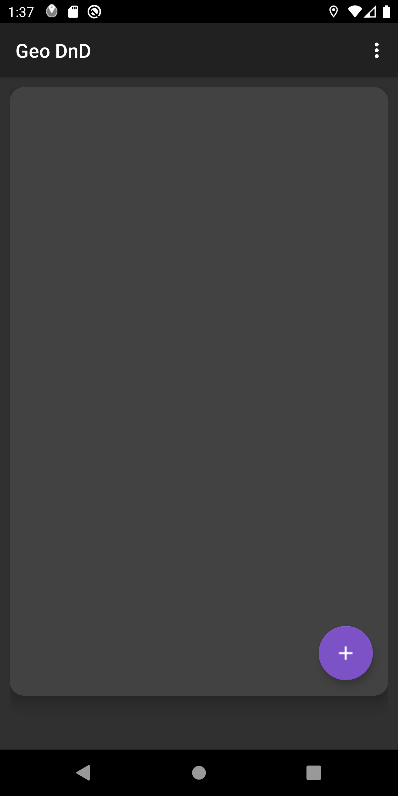
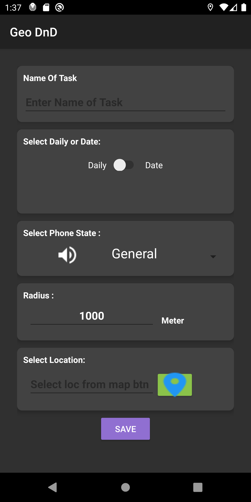
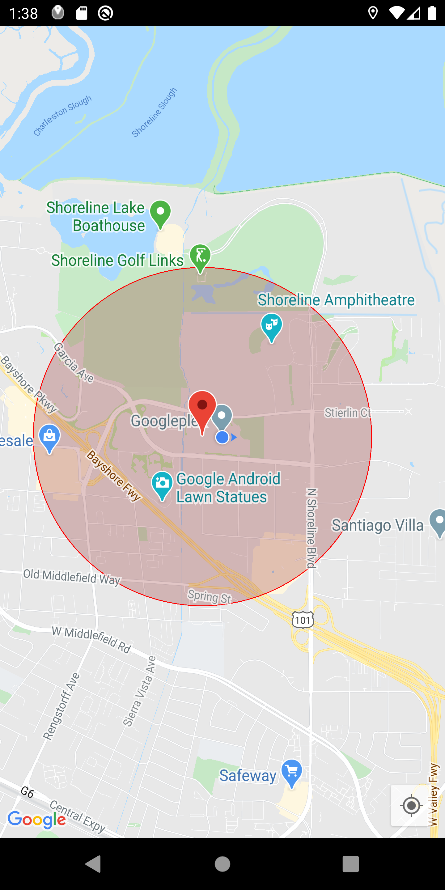
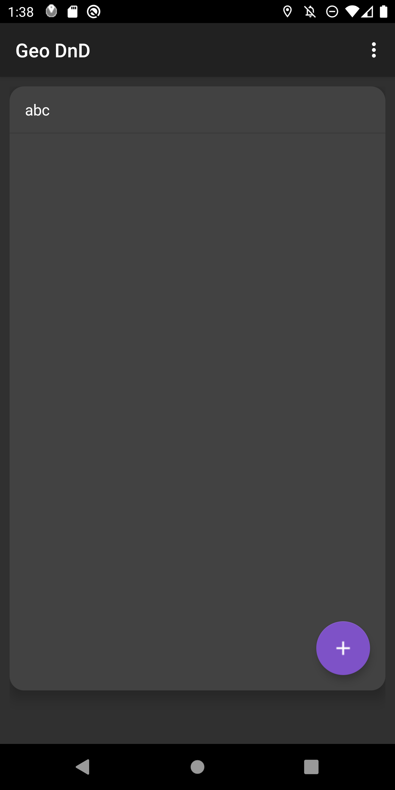
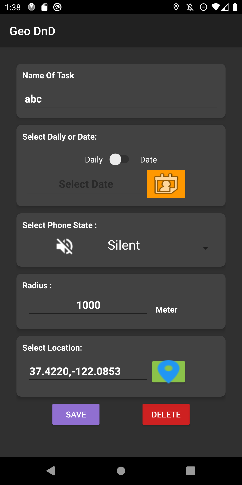
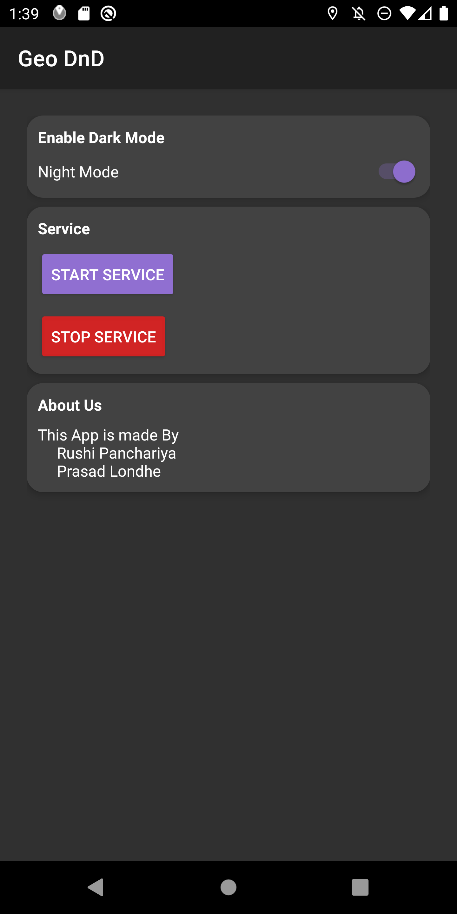

# Geo-DnD
Location Based smart phone will be go on Diffrent Modes Like Silent,DnD,General,Vibrate...etc

In this app we have to set specific radius for circle and select location from Google maps and also we have set mobile mode like general, silent,dnd etc. when we go inside circle it will automatically set that mode. when you come outside circle it will go back to general mode.

# ScreenShot

       

